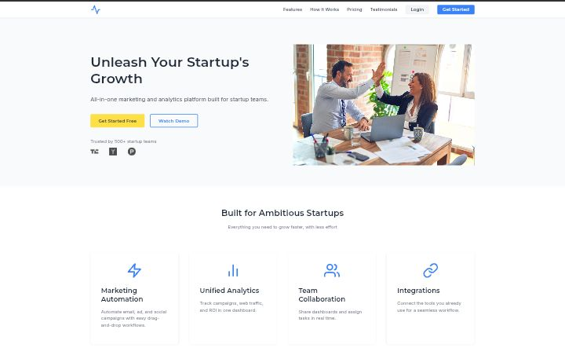

# 🚀 Unruly Landing Page Template

This template is live at [https://unruly-landing-page.netlify.app/](https://unruly-landing-page.netlify.app/).

  
*A modern, responsive landing page template for SaaS startups*

## ✨ Features

- 🎨 **Professional Design**: Clean, modern UI with attention-grabbing elements
- 📱 **Fully Responsive**: Works flawlessly on all devices
- ⚡ **Blazing Fast**: Optimized for performance (90+ Lighthouse score)
- 🛠️ **Easy Customization**: Well-documented code for quick edits
- 🎯 **Conversion Focused**: Designed to maximize sign-ups and engagement

## 🧩 Included Sections

1. **Hero Section** - First impression with clear CTA
2. **Features Grid** - Showcase your product benefits
3. **How It Works** - Demo video/explainer section
4. **Testimonials** - Social proof carousel
5. **Pricing Plans** - Clear pricing tiers
6. **Final CTA** - Strong closing argument
7. **Newsletter Signup** - Lead capture
8. **Footer** - Complete with navigation and social links

## 🛠️ Tech Stack

- **HTML5** - Semantic markup
- **CSS3** - Modern styling with variables
- **JavaScript** - Lightweight interactivity
- **Google Fonts** - Inter & Montserrat typography
- **SVG Icons** - Crisp, scalable graphics

## 🚀 Quick Start

1. Clone the repo:
   ```bash
   git clone https://github.com/Reteecent/unruly-landing-page-template.git
   ```
2. Navigate to project:
   ```bash
   cd unruly-landing-page-template
   ```
3. Open in browser:
   ```bash
   open index.html
   ```

## 🎨 Customization Guide

### 1. Brand Colors
Edit the CSS variables in `styles.css`:
```css
:root {
  --primary: #3B82F6; /* Brand blue */
  --accent: #FDE047;  /* Highlight yellow */
}
```

### 2. Content Updates
Replace placeholder text in `index.html` with your:
- Headlines
- Feature descriptions
- Testimonials
- Pricing details

### 3. Images
Add your assets to `/img` folder:
```
img/
├── logo.svg
├── hero-image.webp
├── testimonial-1.jpeg
└── ...
```

## 🌐 Deployment Options

1. **Netlify** - Drag & drop the `dist` folder
2. **Vercel** - Connect your Git repository
3. **Shared Hosting** - Upload via FTP/cPanel

## 📊 Performance Optimization

- Compress images with [Squoosh](https://squoosh.app/)
- Minify CSS/JS in production
- Enable Gzip compression
- Use CDN for assets

## 📝 License

MIT License - Free for personal and commercial use

[LICENSE](./LICENSE)

## 📬 Contact

For customizations or support:  
📧 reteecent@gmail.com  
🐦 [@Reteecent](https://www.x.com/Reteecent)

---

**Happy Converting!** 🎉  
*Your startup's growth journey starts here*